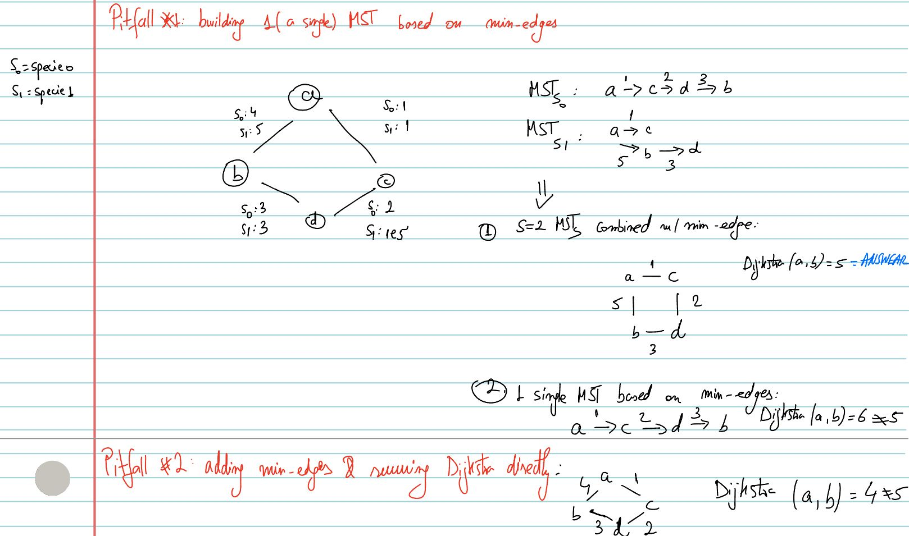

# Topics
- BGL: Kruskal run multiple times to obtain `min_edge` for each edge in each private network of a specie MST + Dijkstra in the end on the final graph

# Idea
- 

# Pitfalls (2)

## Pitfall 1: Building a single MST based on min_edges
- May miss edges that would have otherwise be added in the `S` MSTs approach (where we basically simulate the Ant Challenge). See SS below (edge: e = (a, b) with cost 5 is lost when we compute a single MST, since we've just merged all the min edges and run the MST algo altogether).
## Pitfall 2 (Diana): Add all min_edges & run Dijkstra directly (no Kruskal) 
- May consider edges that would have otherwise not been added in the `S` MSTs approach. See SS below (edge: e = (a,b) with cost 4 of Specie 0 would not be added in the MST of Specie 0. We are not allowed to traverse that edge in the final configuration of the graph). 

# Time Complexity
- `O(S * MlogM)` as we run `S = # of species` Kruskals to Establish the private network of each specie `j in s`
- As `M <= N * (N-1)/2` <=> M ~= N^2 worst case => Time complexity is `O(S * N^2 * logN)`
